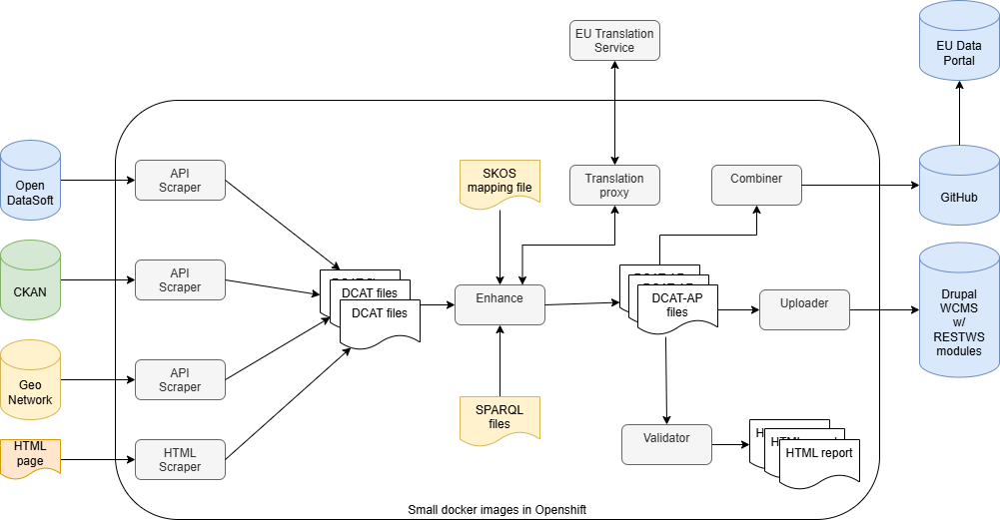

# DCAT tools

Various DCAT tools for harvesting metadata from Belgian open data portals, 
converting them to DCAT-AP files and updating the Belgian 
[data.gov.be](http://data.gov.be) portal

## Data

Only interested in the result ? The N-Triples file (DCAT-AP-ish) can be found
in [data/datagovbe.nt](data/datagovbe.nt)

## Overview of the tools

### Requirements

These tools can be used with Oracle Java runtime 1.8 (1.7 will probably work, 
but not tested), on a headless machine, i.e. there is no fancy GUI.

Internet connection is obviously required, although a proxy can be used.

Binaries can be found in [dist/bin](dist/bin), compiling from source requires the Oracle JDK and Maven.

### Main parts

* Helper classes: for storing scraped pages locally, conversion tools etc.
* Various [scrapers](#scraper): getting metadata from various repositories
and websites, and turning the metadata into DCAT files
* DCAT [enhancers](#enhancer): for improving the DCAT files, e.g. map site-specific themes
add missing properties and prepare the files for updating data.gov.be
* Data.gov.be [updater](#updater): update the data.gov.be (Drupal 7) website using the enhanced DCAT files
* Some [tools](#tools): link checker

### Configuration

All configuration is done using Java (plain text) properties files.
Some examples can be found in [dist/cfg](dist/cfg)

### Notes

* Based on rdf4j (formerly known as Sesame), MapDB, Guava and other Java open source libraries.
* Logging uses SLF4J.

## Scraper

This command-line Java tool scrapes various websites and CKAN portals.

Each site / portal / file requires a specialized scraper Java class and a
configuration file.

Currently, there are abstract Java classes available for scraping
 * CKAN portals, both via the JSON CKAN-API and via RDF rendering
 * OpenDataSoft portals, using the API / DCAT-ish metadata
 * Excel files
 * HTML sites

Invoke with

    # java -jar scraper.jar location/of/config.properties

Use -D to set logging level and save the log to a file

    # java -Dorg.slf4j.simpleLogger.defaultLogLevel=debug 
           -Dorg.slf4j.simpleLogger.logFile=update.log
           -jar scrapper.jar location/of/config.properties

The configuration file is a Java properties file.

    # full class name of the scraper implementation
    be.fedict.dcat.scrapers.classname=be.fedict.dcat.scrapers.CkanWallonie
    # full path to the location (MapDB)
    be.fedict.dcat.scrapers.cache=B:/datagov/data/wallonie/cache
    # full path to store the RDF backing store (SAIL)
    be.fedict.dcat.scrapers.store=B:/datagov/data/wallonie/wallonie.sail
    # full path for the result file (N-Triples)
    be.fedict.dcat.scrapers.rdfout=B:/datagov/data/wallonie/wallonie.nt
    # URL of the site/portal to scrape
    be.fedict.dcat.scrapers.url=http://opendata.digitalwallonia.be
    # default language of the site/portal (nl, fr, de or en)
    be.fedict.dcat.scrapers.deflanguage=fr
    # comma-separated list of the languages on the site/portal (nl fr de en)
    be.fedict.dcat.scrapers.languages=fr

    # optional proxy host and port
    #be.fedict.dcat.scrapers.proxy.host=your.proxy.test
    #be.fedict.dcat.scrapers.proxy.port=888

Note that, in order to avoid overloading the site/portal being scraped, 
the scrapers sleep about 1 second between HTTP requests.

## Enhancer

* LoadRDF: load a RDF file containing triples (e.g. for "static metadata"
like contact info) into the local triple store
* SparqlSelect: perform a Sparql SELECT on the local triple store (e.g. for
listing missing properties)
* SparqlUpdate: perform a SparqlUpdate (INSERT and/or DELETE) on the local
triple store
* SplitProperty: split a property into multiple properties (useful when e.g.
a keyword property contains a concatenated list of keywords) 

The enhancers can be chained.

Mapping e.g. free text keywords to DCAT themes is typically done by loading
an RDF file with SKOS mapping (using altLabel or exactMatch), performing a
SparqlUpdate and removing the SKOS triples.

Invoke with

    # java -jar tools.jar location/of/config.properties

Use -D to set logging level and save the log to a file

    # java -Dorg.slf4j.simpleLogger.defaultLogLevel=debug 
           -Dorg.slf4j.simpleLogger.logFile=enhance.log
           -jar tools.jar location/of/config.properties

The configuration file is a Java properties file.

    # full path to store the RDF backing store (SAIL)
    be.fedict.dcat.enhancers.store=B:/datagov/data/wallonie/enhancer.sail
    # full path to the input file (result of the scraper)
    be.fedict.dcat.enhancers.rdfin=B:/datagov/data/wallonie/wallonie.nt
    # full path to store the result (N-Triples)
    be.fedict.dcat.enhancers.rdfout=B:/datagov/data/wallonie/enhanced.nt

    # full class name of the enhancer implementation
    be.fedict.dcat.enhancers.1.classname=be.fedict.dcat.enhancers.SparqlUpdate
    # full path to the Sparql Update script to load
    be.fedict.dcat.enhancers.1.sparqlfile=B:/datagov/cfg/wallonie/sparql-lang-def.txt

    # full class name of the enhancer implementation
    be.fedict.dcat.enhancers.2.classname=be.fedict.dcat.enhancers.SplitProperty
    # name of the property to split
    be.fedict.dcat.enhancers.2.property=http://purl.org/dc/terms/coverage
    # separator character
    be.fedict.dcat.enhancers.2.separator=,

    # full class name of the enhancer implementation
    be.fedict.dcat.enhancers.3.classname=be.fedict.dcat.enhancers.LoadRDF
    # full path to the RDF file to load
    be.fedict.dcat.enhancers.3.rdffile=B:/datagov/cfg/wallonie/data-contact.ttl

    # full class name of the enhancer implementation
    be.fedict.dcat.enhancers.4.classname=be.fedict.dcat.enhancers.SparqlSelect
    # full path to the Sparql Query script to load
    be.fedict.dcat.enhancers.4.sparqlfile=B:/datagov/cfg/common/select-spatial.txt
    # full path to the export file 
    be.fedict.dcat.enhancers.4.outfile=B:/datagov/data/wallonie/geo-missing.txt

 
## Updater

This tool updates the data.gov.be (Drupal 7) site using a REST interface,
provided the Drupal modules RestWS and RestWS_i18n are installed.

Invoke with

    # java -jar datagovbe.jar location/of/config.properties

Use -D to set logging level and save the log to a file

    # java -Dorg.slf4j.simpleLogger.defaultLogLevel=debug 
           -Dorg.slf4j.simpleLogger.logFile=update.log
           -jar datagovbe.jar location/of/config.properties

The configuration file is a Java properties file.

    # URL of the Drupal 7 website
    be.fedict.datagovbe7.drupal=http://data.gov.be
    # Comma separated list of language codes
    be.fedict.datagovbe7.languages=nl,fr

    # Drupal user ID number
    be.fedict.datagovbe7.userid=1234
    # Drupal user login
    be.fedict.datagovbe7.user=mylogin
    # Drupal user password
    be.fedict.datagovbe7.pass=secret_password

    # Proxy settings, comment out if no proxy is required
    #be.fedict.datagovbe7.proxy.host=your.proxy
    #be.fedict.datagovbe7.proxy.port=8080

    # Local N-Triples DCAT file to be used for updating the site
    be.fedict.datagovbe7.rdfin=B:/datagov/data/statbelpubs/enhanced.nt
    # Temporarily local RDF store that will be used to load the DCAT file 
    be.fedict.datagovbe7.store=B:/datagov/data/statbelpubs/drupal.sail
    

## Tools

A collection of various tools, currently only a simple command line link checker is implemented.
It uses HEAD HTTP requests and pauses between requests (to avoid overloading the server)

Invoke with

    # java -jar tools.jar be.fedict.dcat.tools.LinkChecker location/of/config.properties

Use -D to set logging level and save the log to a file

    # java -Dorg.slf4j.simpleLogger.defaultLogLevel=debug 
           -Dorg.slf4j.simpleLogger.logFile=linkchekcer.log
           -jar tools.jar be.fedict.dcat.tools.LinkChecker 
            location/of/config.properties
