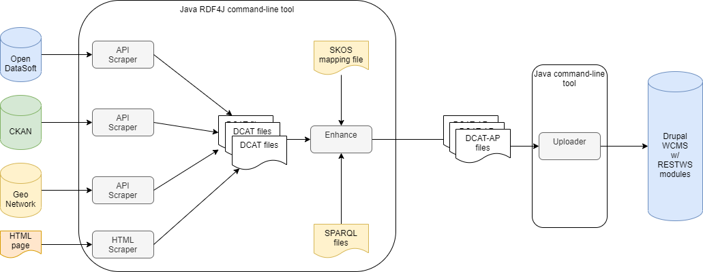

# DCAT tools

Various DCAT tools for harvesting metadata from Belgian open data portals, 
converting metadata to DCAT-AP files and updating the Belgian 
[data.gov.be](http://data.gov.be) portal.

The portal itself is a Drupal 7 website, based on Fedict's 
[Openfed](https://drupal.org/project/openfed) distribution plus two extra modules
[RestWS](https://drupal.org/project/restws) and 
[RestWS i18n](https://www.drupal.org/project/restws_i18n).

## Data

Only interested in the result ? The N-Triples and XML files (DCAT-AP) 
used to update data.gov.be can be found in the [dcat repository](https://github.com/fedict/dcat)

## Overview of the tools

### Requirements

These tools can be used with a Java runtime 11 or newer, on a headless machine, i.e. there is no fancy GUI.

Internet connection is obviously required, although a proxy can be used.

### Main parts

* Helper classes: for storing scraped pages locally, conversion tools etc.
* Various [scrapers](README-SCRAPER.md): getting metadata from various repositories
and websites, and turning the metadata into DCAT files
* Also part of the scrapers are a series of [SPARQL scripts](README-ENHANCERS.md) to turn DCAT into DCAT-AP: 
e.g. map site-specific themes, add missing properties and prepare the files for updating data.gov.be
* Data.gov.be [updater](README-UPLOADER.md): update the data.gov.be (Drupal 7) website 
using the enhanced DCAT files
* Some [tools](#tools): link checker, EDP converter tool

There is also separate, stand-alone RDF [validator](https://github.com/fedict/rdfvalidator) 
project which can be used to validate DCAT metadata,
regardless if the metadata is to be published on data.gov.be or not.

## Steps for updating data.gov.be and the EU Data Portal

  * The various portals (except `all`) should be harvested using the scrapers.
  * The enhanced files can be uploaded to the data.gov.be portal using the updater
  * Then use `all` enhancer to merge all the files from the various portals into one file `datagovbe.nt`
  * Convert the merged file using the EDP tool to an XML file called `datagovbe_edp.xml`
  * Upload both the `datagovbe.nt` and `datagovbe_edp.xml` to [github](https://github.com/fedict/dcat)
  * This will be used as input for the European Data Portal (scheduled Thursday morning, every week)

### Configuration

All configuration is done using Java (plain text) properties files.
Some examples can be found in [dist/cfg](dist/cfg)

See also the [Notes](README-NOTES.md)
